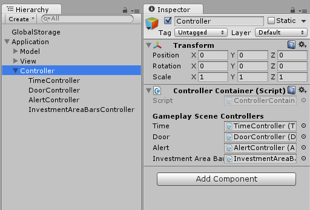
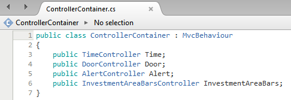

# Unity3D MVC

Basic scripts for creating Unity games following MVC patterns. The concept is based on the article [Unity with MVC: How to Level Up Your Game Development](https://www.toptal.com/unity-unity3d/unity-with-mvc-how-to-level-up-your-game-development) written by Eduardo Dias.

I've made some changes to fit my needs. Those are the scripts I use when starting a new Unity project. And here is how it's structured on the scene hierarchy:

## Linking the scripts

On the root of "Scripts" folder you find the base scripts to link to those game objects of the screenshot above:

- Application (Application.cs)
  - Model (ModelContainer.cs)
  - View (ViewContainer.cs)
  - Controller (ControllerContainer.cs)

## The containers

The game objects "Model", "View", "Controller" are containers for any other scripts you create inheriting the MvcBehaviour class, which is mandatorily a model, a view or a controller.

Here is an example of how you would add controllers to the Controller Container:

Note that TimeController, DoorController, AlertController and InvestmentAreaBarsController are all derived from MvcBehaviour too. And those scripts are attached to their related game objects on scene - children of the Controller game object.

## Separation in Models, Views and Controllers

In summary, _Models_ hold the data structure and current values, _Views_ hold the references of game objects on scene and _Controllers_ control how the objects will behave on scene, using the data from models and the references from views.

## The GlobalStorage - Passing values/objets through scenes

Now you might be asking: "If my game has more than one scene, do I need to crate a MVC structure in all scenes? If so, do I have to reinitialize the game objects everytime? Then, how to I keep the state of my game through the scenes?"

Yes, you need to create the same structure on all scenes, and yes, you lose the data from the scripts on your game objects.

That's where the GlobalStorage comes in. Check it out:

[GlobalStorage](https://github.com/felladrin/unity3d-globalstorage) - *Unity3D Script to store persistent data in JSON format and watch them live on Inspector*.

## License

The MIT License  
<http://victor.mit-license.org>
