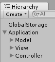

# Unity3D MVC

Basic scripts for creating Unity games following MVC patterns. The concept is based on Eduardo Dias' [Unity with MVC: How to Level Up Your Game Development](https://www.toptal.com/unity-unity3d/unity-with-mvc-how-to-level-up-your-game-development) article.

I've made some changes to fit my needs. Those are the scripts I use when starting a new Unity project. And here is how the structure is organized on the scene hierarchy:

